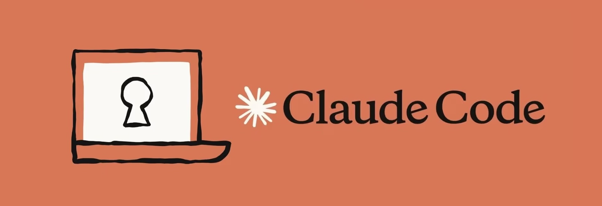

# 🤖 Claude Code pour les Dev & DevOps — Formation pratique

<p align="center">
  
</p>

> Parcours de formation **hands-on** à l'usage de **Claude Code** (l'agent de coding dans le
> terminal) pour les équipes **Dev / DevOps**, illustré de bout en bout sur une application
> **.NET microservices** réelle.


---

## 📑 Sommaire

- [🤖 Claude Code pour les Dev \& DevOps — Formation pratique](#-claude-code-pour-les-dev--devops--formation-pratique)
  - [📑 Sommaire](#-sommaire)
  - [🎯 Contexte](#-contexte)
  - [👥 À qui s'adresse ce repo](#-à-qui-sadresse-ce-repo)
  - [🗂️ Structure du dépôt](#️-structure-du-dépôt)
  - [✅ Pré-requis](#-pré-requis)
  - [🧭 Parcours pédagogique](#-parcours-pédagogique)
  - [🖼️ Supports de présentation (slides)](#️-supports-de-présentation-slides)
  - [🧩 Les cas d'usage (UC)](#-les-cas-dusage-uc)
    - [Détail des cas d'usage](#détail-des-cas-dusage)
      - [🧱 Bloc 1 — Code, collaboration \& qualité ✅](#-bloc-1--code-collaboration--qualité-)
      - [📦 Bloc 2 — Conteneurs \& orchestration ✅](#-bloc-2--conteneurs--orchestration-)
      - [🗄️ Bloc 3 — Données \& application 🚧](#️-bloc-3--données--application-)
      - [📈 Bloc 4 — Performance \& fiabilité 🚧](#-bloc-4--performance--fiabilité-)
  - [▶️ Comment dérouler un lab](#️-comment-dérouler-un-lab)
  - [📐 Conventions du repo](#-conventions-du-repo)
  - [🛡️ Garde-fous \& conformité](#️-garde-fous--conformité)
  - [🗺️ Feuille de route](#️-feuille-de-route)
  - [✍️ Auteur](#️-auteur)

---

## 🎯 Contexte

Ce dépôt regroupe les **supports de formation** et les **exercices corrigés** utilisés pour outiller
les équipes **Dev / DevOps** à l'usage maîtrisé de l'IA générative dans le cycle de développement et
d'exploitation. La pédagogie est **≈30 % théorie / 70 % pratique**, chaque lab étant pensé pour être
**déroulé en direct dans un terminal**.

Le fil rouge est une application e-commerce **microservices .NET / ASP.NET Core** orchestrée par
**.NET Aspire** (`ecommerce-app`), que l'on va **versionner, tester, conteneuriser, déployer et
observer** au fil des cas d'usage.

> Le programme détaillé (briques Claude Code, blocs, capstone) est dans
> [`plan-action-claude-code-dev.md`](plan-action-claude-code-dev.md).

## 👥 À qui s'adresse ce repo

Ingénieurs **Dev et DevOps** — y compris **débutants** sur Claude Code : chaque étape est expliquée
(le *quoi* et le *pourquoi*), sans pré-requis avancé.

---

## 🗂️ Structure du dépôt

```
.
├── claude-code.jpg                     # Bannière
├── 01-prompt-engineering.md            # Fondation : prompting dans l'app Claude
├── 02-claude-code-intro.md             # Fondation : prise en main de Claude Code (CLI)
├── plan-action-claude-code-dev.md      # Plan d'action & programme de formation
├── slides/                             # Supports de présentation (PDF)
│   ├── 00-plan.pdf                     #   Vue d'ensemble du parcours
│   ├── 01-intro-gai-prompt.pdf         #   Partie 1 — IA générative & prompt engineering
│   └── 02-claude-code.pdf              #   Partie 2 — Claude Code (briques + cas d'usage)
├── labs/                               # Supports pas-à-pas + corrigés des UC + plugin
│   ├── UC1-git.md … UC6-helm.md        #   Supports pas-à-pas (Blocs 1 & 2 disponibles)
│   ├── UC1/ … UC6/                     #   Corrigés (.claude, .github, k8s, helm…)
│   └── plugins/ecommerce-ops/          #   Plugin d'équipe (commandes + skills + hooks + MCP)
├── ecommerce-app/                      # Application fil rouge (.NET Aspire microservices)
│   ├── ECommerce.slnx
│   └── src/                            #   Catalog · Ordering · Gateway · Web · AppHost · ServiceDefaults
└── README.md                           # Ce fichier
```

Chaque dossier `labs/UCx/` contient le **corrigé** de l'exercice (un `README.md` + les fichiers
`.claude/`, `.github/`, `k8s/`, `helm/`…). Pendant la formation, les participants **créent ces
fichiers en temps réel** sur l'app `ecommerce-app/` ; le corrigé sert de référence en cas de blocage.

---

## ✅ Pré-requis

| Outil | Usage dans la formation | Vérif |
|---|---|---|
| Claude Code | l'agent | `claude --version` · `claude doctor` |
| Git + GitHub CLI (`gh`) | versioning, PR, CI | `git --version` · `gh auth status` |
| Docker / Podman | conteneurs, build d'images | `docker version` |
| kubectl + **k3d** (ou kind/minikube) | cluster Kubernetes local | `kubectl version --client` · `k3d version` |
| Helm | packaging Kubernetes | `helm version` |
| k6 (Grafana) | générateur de charge | `k6 version` |
| .NET 10 SDK | builder l'app fil rouge | `dotnet --version` |

> Sur poste verrouillé : prévoir un **conteneur / VM bac à sable** avec ces outils, pour ne rien
> installer sur le poste hôte. Chaque support d'UC détaille l'installation pour **macOS / Linux / Windows**.

---

## 🧭 Parcours pédagogique

```
1. 01-prompt-engineering.md   → comprendre et pratiquer le prompting (app Claude)
2. 02-claude-code-intro.md    → prendre en main Claude Code (CLI, commandes, préfixes @ ! # /)
3. UC1 → UC2 → … → UC6        → enchaîner les cas d'usage Dev / DevOps sur ecommerce-app
```

Les briques Claude Code sont introduites dans l'ordre : **Commandes → Skills → Hooks → MCP →
Plugins**, puis appliquées aux cas d'usage.

---

## 🖼️ Supports de présentation (slides)

Les supports théoriques (beamer, exportés en PDF dans [`slides/`](slides/)) :

| Deck | Contenu |
|---|---|
| [`00-plan.pdf`](slides/00-plan.pdf) | Vue d'ensemble du parcours (Partie 1 + Partie 2, UC1–UC11). |
| [`01-intro-gai-prompt.pdf`](slides/01-intro-gai-prompt.pdf) | IA générative, des LLM aux agents, **techniques de prompt engineering** (exemples Dev & DevOps). |
| [`02-claude-code.pdf`](slides/02-claude-code.pdf) | **Claude Code** : installation, briques (commandes, Skills, hooks, MCP, plugins) et **cas d'usage Dev / DevOps**. |

---

## 🧩 Les cas d'usage (UC)

> **Légende statut :** ✅ disponible · 🚧 planifié (support à venir)

| UC | Cas d'usage | Bloc | Briques Claude Code | Statut | Support |
|---|---|---|---|:---:|---|
| **UC1** | Git & GitHub | 1 — Code & qualité | Commandes, Skills, Hooks, MCP | ✅ | [`UC1-git`](labs/UC1-git.md) · [`UC1/`](labs/UC1/) |
| **UC2** | CI/CD | 1 — Code & qualité | Skill `ci-pipeline`, MCP (Actions) | ✅ | [`UC2-cicd`](labs/UC2-cicd.md) · [`UC2/`](labs/UC2/) |
| **UC3** | Tests | 1 — Code & qualité | Skill `gen-tests`, `/code-review` | ✅ | [`UC3-tests`](labs/UC3-tests.md) · [`UC3/`](labs/UC3/) |
| **UC4** | Docker / images | 2 — Conteneurs & orchestration | Skill `containerize`, hook scan image | ✅ | [`UC4-docker`](labs/UC4-docker.md) · [`UC4/`](labs/UC4/) |
| **UC5** | Cluster Kubernetes | 2 — Conteneurs & orchestration | Skills `k8s-bootstrap`, `k8s-debug-pod` | ✅ | [`UC5-kubernetes`](labs/UC5-kubernetes.md) · [`UC5/`](labs/UC5/) |
| **UC6** | Helm / packaging | 2 — Conteneurs & orchestration | Skill `helm-package`, `/code-review` | ✅ | [`UC6-helm`](labs/UC6-helm.md) · [`UC6/`](labs/UC6/) |
| **UC7** | Base de données | 3 — Données & application | MCP base de données, sous-agent SQL | 🚧 | _à venir_ |
| **UC8** | UI / frontend | 3 — Données & application | Commandes, skill design, `/code-review` | 🚧 | _à venir_ |
| **UC9** | Load generator (k6) | 4 — Performance & fiabilité | Skill `load-test`, MCP observabilité | 🚧 | _à venir_ |
| **UC10** | Observabilité | 4 — Performance & fiabilité | Skills, MCP observabilité | 🚧 | _à venir_ |
| **UC11** | Incident & analyse de logs | 4 — Performance & fiabilité | Skill `postmortem`, MCP Jira, hook audit | 🚧 | _à venir_ |

### Détail des cas d'usage

#### 🧱 Bloc 1 — Code, collaboration & qualité ✅
- **UC1 — Git & GitHub** : workflow Git assisté (branche, **commit Conventional Commits**, PR
  documentée) + **hook anti-secret** qui bloque tout commit contenant une clé/mot de passe.
- **UC2 — CI/CD** : génération de workflows **GitHub Actions** (build .NET, tests, scan Trivy) et
  déploiement avec **gate manuel** avant la production.
- **UC3 — Tests** : tests **d'intégration** sur les vrais endpoints (`WebApplicationFactory`, base
  **in-memory**), mesure de **couverture** et identification des cas manquants.

#### 📦 Bloc 2 — Conteneurs & orchestration ✅
- **UC4 — Docker** : Dockerfiles **multi-stage**, non-root, image chiselée, `docker-compose` dev,
  correctifs des findings Trivy.
- **UC5 — Kubernetes** : cluster **k3d**, manifests (Deployments, Services, Ingress, probes, HPA),
  **diagnostic d'un pod en échec**.
- **UC6 — Helm** : packaging en **chart** paramétrable, *values* multi-environnements (dev/preprod).

#### 🗄️ Bloc 3 — Données & application 🚧
- **UC7 — Base de données** : schéma, **migrations EF Core**, seed anonymisé, optimisation de requêtes.
- **UC8 — UI / frontend** : modernisation de l'IHM (responsive, **a11y**, états de chargement), maquettes.

#### 📈 Bloc 4 — Performance & fiabilité 🚧
- **UC9 — Load generator** : scénarios **k6** (paliers, seuils p95), analyse de goulots.
- **UC10 — Observabilité** : **Prometheus/Grafana**, dashboards, requêtes (PromQL/LogQL), règles d'alerte.
- **UC11 — Incident & logs** : triage, **clustering d'erreurs**, hypothèses de cause racine,
  **post-mortem blameless**.

> **Bonus / approfondissement** (voir le plan d'action) : Networking, Backup & restore, GitOps,
> FinOps, Capacity planning, Documentation (runbooks, ADR, diagrammes Mermaid).

> **Capstone** — un atelier final enchaîne les UC pour livrer l'`ecommerce-app` de la
> conteneurisation à la production observée (conteneuriser → déployer → tester → observer →
> diagnostiquer un incident → packager en plugin).

---

## ▶️ Comment dérouler un lab

```bash
# 1. Se placer dans l'app fil rouge (page blanche : pas de .claude pré-installé)
cd ecommerce-app
claude

# 2. Suivre le support de l'UC (ex. labs/UC1-git.md)
#    → on crée les fichiers (skills/hooks) en live, étape par étape, et on vérifie en bash
```

En cas de blocage, appliquer le **corrigé** de l'UC :
```bash
cp -r labs/UC1/.claude ecommerce-app/      # exemple pour UC1
```
Chaque `labs/UCx/README.md` rappelle la commande exacte.

---

## 📐 Conventions du repo

- **`0x-…`** : supports **fondation** (prompting, prise en main de Claude Code).
- **`slides/`** : supports de **présentation** (PDF beamer).
- **`labs/UCx-<sujet>.md`** : support **d'un cas d'usage** (déroulé pas-à-pas, débutant-friendly :
  installation 3 OS, lancement des skills/commandes + équivalent bash, vérification bash).
- **`labs/UCx/`** : **corrigé** du cas d'usage (fichiers `.claude/`, `.github/`, `k8s/`, `helm/`… + README).
- **`labs/plugins/ecommerce-ops/`** : **plugin d'équipe** packageant commandes + skills + hooks + MCP.
- **`ecommerce-app/`** : application fil rouge ; les participants partent d'une **page blanche** (sans `.claude`).
- Skills Claude Code : `.claude/skills/<nom>/SKILL.md` · Hooks : `.claude/hooks/` + `settings.json`.

---

## 🛡️ Garde-fous & conformité

Adapté à un **contexte bancaire** (DORA, RGPD) :

- ❌ **Jamais** de secret ni de donnée client non anonymisée dans un prompt.
- ✅ Les actions **destructives / prod** (`apply`, `destroy`, `delete`, `merge`, déploiement prod)
  passent **toujours** par une **validation humaine** (`/permissions`, hooks de garde, gate CI).
- 🔍 Traçabilité : journaux d'audit des actions de l'agent.
- 🧠 L'IA **propose**, l'ingénieur **décide et teste**.

---

## 🗺️ Feuille de route

- [x] **Bloc 1 — Code, collaboration & qualité** (UC1 Git, UC2 CI/CD, UC3 Tests)
- [x] **Bloc 2 — Conteneurs & orchestration** (UC4 Docker, UC5 Kubernetes, UC6 Helm)
- [ ] **Bloc 3 — Données & application** (UC7 Base de données, UC8 UI / frontend)
- [ ] **Bloc 4 — Performance & fiabilité** (UC9 Load k6, UC10 Observabilité, UC11 Incident & logs)
- [ ] **Capstone** — chaîne end-to-end

---

## ✍️ Auteur

**Bassem Ben Hamed** — formation IA générative Claude Code pour les équipes Dev & DevOps.
